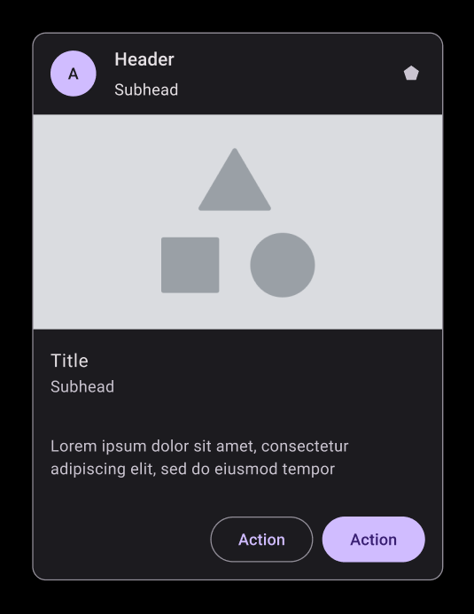
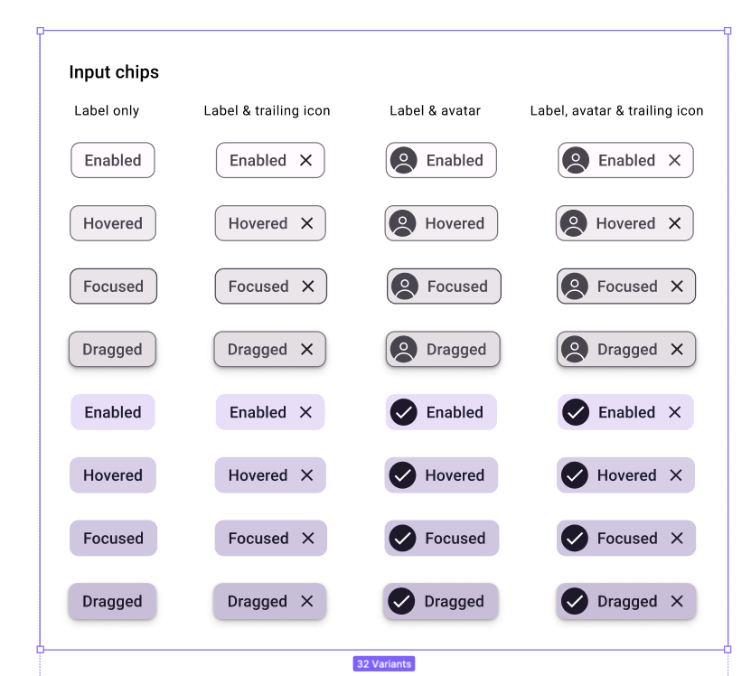
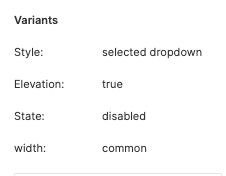

# Требования

## Шрифты
1. Должен быть добавлен фрейм со списком шрифтов 
   1. 
   2. Шрифт состоит из
      * font-family
      * font-size
      * font-style
      * font-weight
      * line-height
      * letter-spacing
      * и прочие свойства по необходимости
   3. Все шрифты используемые в проекте должны находится в этом списке;
   4. Каждый из шрифтов должен быть добавлен в раздел "Text styles" фигмы; 
      1. 
   5. Название шрифта из списка "Text styles" должно носить осмысленное название;
   6. Для каждого текста в проекте должен быть прописано свойство Text, содержащее значение из списка "Text styles";
      1. 
   7. Не должно быть значений в списке "Text styles", которые не используются в проекте;
2. В проекте не должно использоваться более 1-2 font-family
   1. Использование каждого font-family должно быть оправдано
   2. Нельзя использовать почти одинаковые font-family

## Цвета
1. Должен быть добавлен фрейм со списком цветов 
   1. 
   2. Все цвета используемые в проекте должны находится в этом списке;
   3. Каждый из цветов должен быть добавлен в раздел "Color styles" фигмы; 
      1. 
      2. Цвета должны быть собраны в группы, согласно логике приложения;
   4. Для каждого шрифта, заливки или штриховки должно быть прописано значение из списка "Color styles";
      1.  
   5. Не должно быть значений в списке "Color styles", которые не используются в проекте;
   6. Не должно быть почти одинаковых цветов;

## Компоненты
1. Дизайн должен быть разбит на компоненты
   1. Каждый атомарный элемент дизайна должен быть выделен в отдельный компонент;
   2. Малые компоненты могут быть:
      * Кнопки;
      * Карточки товара;
      * Иконки;
      * Диалоговые попапы;
      * Инпуты;
      * Списки элементов;
      * Элементы навигации;
      * прочее...
   3. Если два компонента одинаковые, то это должен быть один компонент; 
   4. Если два компонента почти одинаковые, то это должно быть два варианта одного компонента; 
2. Группировка на большие компоненты
   1. Большой компонент состоит из малых компонентов;
      1. 
   2. Для всех малых компонентов внутри большого должно быть выставлено выравнивание;
   3. Если компонент может изменять размеры, то допустимые размеры должны быть отрисованы;
3. Варианты компоненты
   1. Все состояние компонента должны быть созданы как его варианты 
      1. 
   2. Для вариантов должны быть добавлены свойства, которые описывают отличия одного варианта от другого
      1. 
4. Размеры
   1. Размеры должны иметь целое значение;
   2. Дробное значение допускается только если оно реально необходимо;
   3. Если элементы должны иметь какое-то выравнивание, то оно должно соблюдаться всегда;

## Страницы

