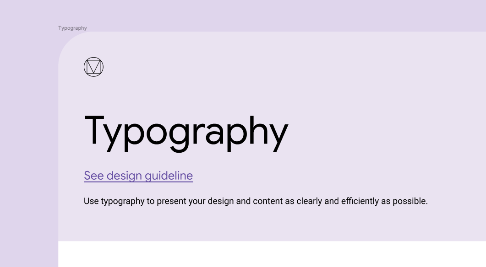
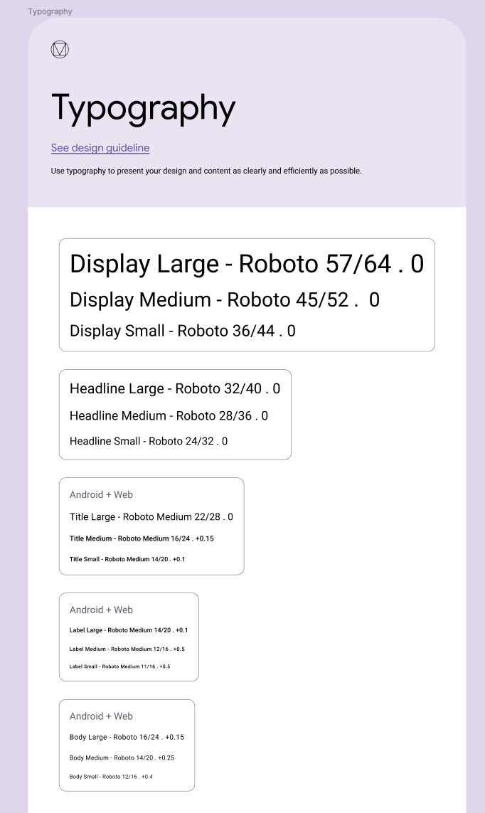
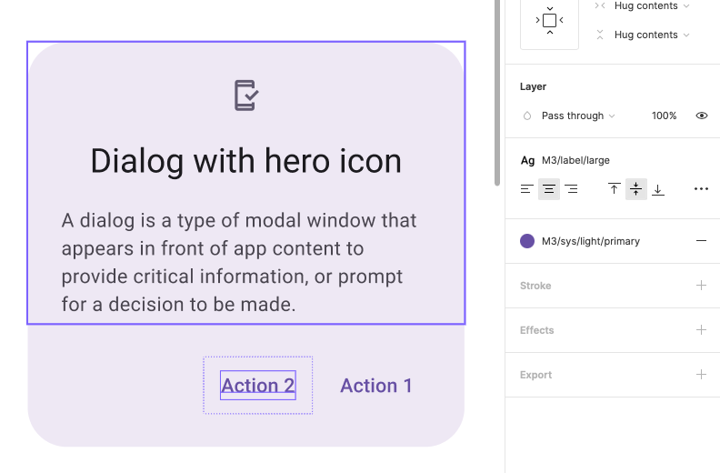
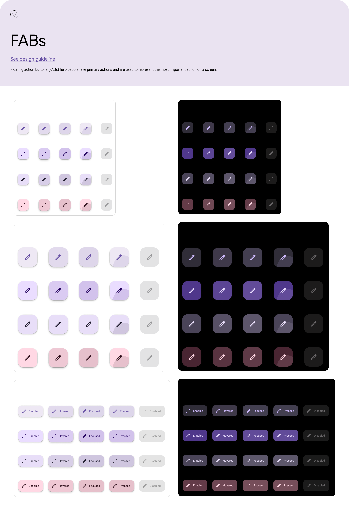
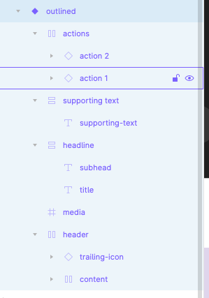
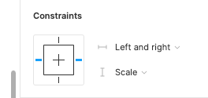

# Требования

## Ассеты
1. Для ассетов создаётся отдельная страница в фигме;
   1. 
2. Ассеты бывают:
   1. Шрифты;
   2. Цвета;
   3. Эффекты;
   4. Иконки;
   5. Сетки;
   6. прочее...
3. Каждый тип ассета добавляется в отдельный фрейм;
4. Название фрейма обозначает тип ассета;
   1. 

## Шрифты
1. Должен быть добавлен фрейм со списком шрифтов 
   1. 
   2. Шрифт состоит из
      * font-family
      * font-size
      * font-style
      * font-weight
      * line-height
      * letter-spacing
      * и прочие свойства по необходимости
   3. Все шрифты используемые в проекте должны находится в этом списке;
   4. Каждый из шрифтов должен быть добавлен в раздел "Text styles" фигмы; 
      1. 
   5. Название шрифта из списка "Text styles" должно носить осмысленное название;
   6. Для каждого текста в проекте должен быть прописано свойство Text, содержащее значение из списка "Text styles";
      1. 
   7. Не должно быть значений в списке "Text styles", которые не используются в проекте;
2. В проекте не должно использоваться более 1-2 font-family
   1. Использование каждого font-family должно быть оправдано;
   2. Нельзя использовать почти одинаковые font-family;

## Цвета
1. Должен быть добавлен фрейм со списком цветов 
   1. 
   2. Все цвета используемые в проекте должны находится в этом списке;
   3. Каждый из цветов должен быть добавлен в раздел "Color styles" фигмы; 
      1. 
      2. Цвета должны быть собраны в группы, согласно логике приложения;
   4. Для каждого шрифта, заливки или штриховки должно быть прописано значение из списка "Color styles";
      1.  
   5. Не должно быть значений в списке "Color styles", которые не используются в проекте;
   6. Не должно быть почти одинаковых цветов;

## Компоненты
1. Для компонентов создаётся отдельная страница в фигме;
2. Дизайн должен быть разбит на компоненты;
   1. Каждый атомарный элемент дизайна должен быть выделен в отдельный компонент;
   2. Малые компоненты могут быть:
      * Кнопки;
      * Карточки товара;
      * Иконки;
      * Диалоговые попапы;
      * Инпуты;
      * Списки элементов;
      * Элементы навигации;
      * прочее...
   3. Если два компонента одинаковые, то это должен быть один компонент; 
   4. Если два компонента почти одинаковые, то это должно быть два варианта одного компонента;
   5. Однотипные малые компоненты должны быть собраны в один фрейм;
      1. 
      2. Имя этого фрейма должно быть осмысленным и обозначать тип содержимых компонентов;
         1. 
      3. Компоненты этого типа не должны существовать за пределами этого фрейма;
3. Группировка на большие компоненты;
   1. Большой компонент состоит из малых компонентов;
      1. 
   2. Состовляющие части компонента должны быть разбиты на группы;
      1. У всех групп должны быть осмысленные имена;
         1. 
      2. Группа не должна содержать много элементов;
      3. Элементы группы должны находиться визуально вместе и не содержать постороннего мусора;
   3. Для всех малых компонентов внутри большого должно быть выставлено выравнивание;
      1. 
   4. Вместо выравнивания можно использовать autolayout и resizing;
      1. 
   5. Если компонент может изменять размеры, то допустимые размеры должны быть отрисованы;
4. Варианты компоненты
   1. Все состояние компонента должны быть созданы как его варианты;
      1. 
   2. Для вариантов должны быть добавлены свойства, которые описывают отличия одного варианта от другого;
      1. 
5. Размеры
   1. Размеры должны иметь целое значение;
   2. Дробное значение допускается только если оно реально необходимо;
   3. Если элементы должны иметь какое-то выравнивание, то оно должно соблюдаться всегда;

## Страницы
1. Для страниц проекта создаётся отдельная страница в фигме;
2. Страница состоит из:
   1. Лайаут;
   2. Компоненты страницы;
   3. Дополнительные элементы (например плавающие);
3. На странице должны быть только большие компоненты; 
4. Все состояния страницы должны быть отрисованы рядом друг к другу;
